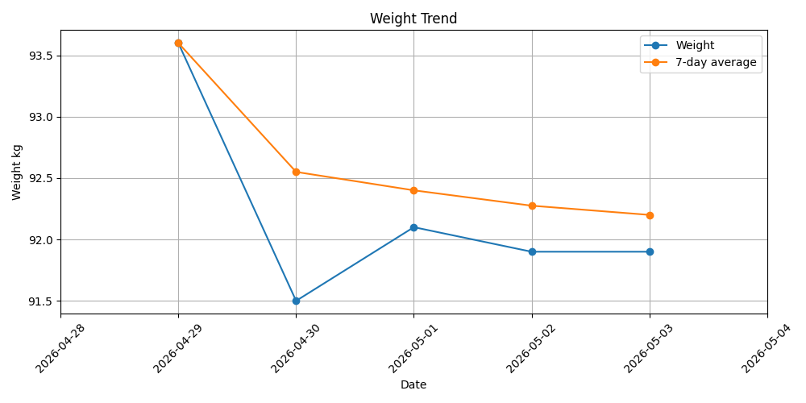
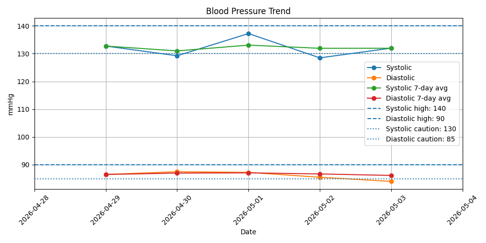

# Health Project

脂質異常症と肥満改善のための生活管理リポジトリ。

## 最低限やること

毎日やるのはこれだけ。

- 体重を記録する
- 食事をざっくり書く
- 10分以上歩く

## 運用ルール

完璧にやらない。
記録が抜けても戻ればOK。
体重より「記録を続けた日数」を重視する。

## 毎週見るもの

- 体重の7日平均
- 外食回数
- 夜食・間食の回数
- 歩いた日数

## Health Analysis

<!-- HEALTH_ANALYSIS_START -->

### 最新サマリー

| 項目 | 結果 |
|---|---|
| 最新日平均血圧 | 132.0/84.0 mmHg |
| 判定 | 注意: やや高めです |
| 朝の血圧 | 平均 137.4/88.9 mmHg　直近 132.0/84.0 mmHg　注意（やや高め） |
| 夜の血圧 | 平均 125.1/83.2 mmHg　直近 120.0/80.5 mmHg　良好 |
| 朝夜差 | 収縮期差（朝－夜）: +12.3 mmHg　⚠️ 早朝高血圧の可能性（朝が夜より収縮期 +12.3 mmHg 高い） |
| 脈拍状態 | 良好: 直近の脈拍 75.5 bpm（正常範囲） |
| 脈拍異常記録 | 2026-05-02 night / 112.5 bpm / ⚠️ 頻脈 |
| CPAP着用率 | 4/5日 (80%) （記録5日分・記憶ベース含む） |
| CPAP着用時 朝収縮期平均 | 134.1 mmHg |
| CPAP未着用時 朝収縮期平均 | 150.5 mmHg |
| CPAP有無の影響 | ⚠️ 未着用時は収縮期が平均 +16.4 mmHg 高い |
| 体重×血圧 相関 | 収縮期: 0.31 拡張期: 0.06 明確な相関はまだ見えません |
| 体重増→血圧上昇検出 | 判定不可（最低7日以上必要） |

<!-- HEALTH_ANALYSIS_END -->