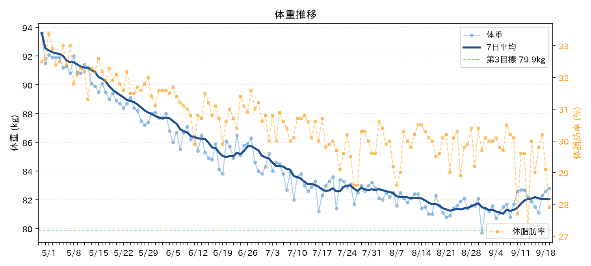
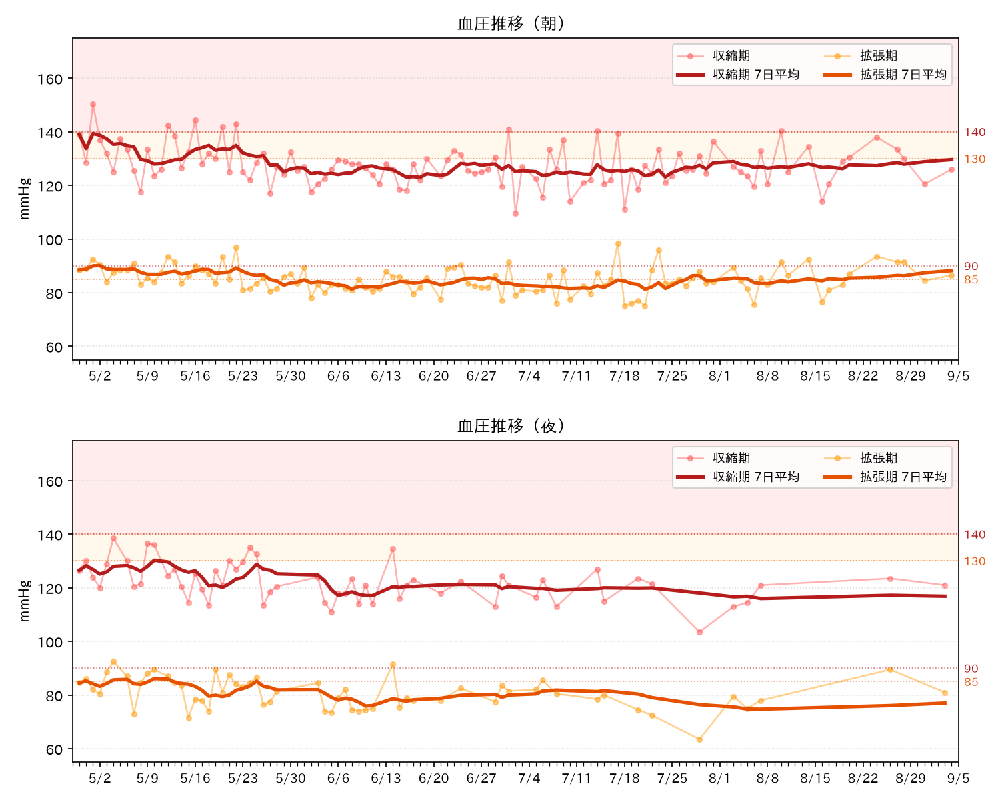

# Health Project

脂質異常症と肥満改善のための生活管理リポジトリ。

## 最低限やること

毎日やるのはこれだけ。

- 体重を記録する
- 食事をざっくり書く
- 10分以上歩く

## 運用ルール

完璧にやらない。
記録が抜けても戻ればOK。
体重より「記録を続けた日数」を重視する。

## 毎週見るもの

- 体重の7日平均
- 外食回数
- 夜食・間食があった日数
- 歩いた日数

## Health Analysis

<!-- HEALTH_ANALYSIS_START -->

### 最新サマリー

| 項目 | 結果 |
|---|---|
| 直近の朝血圧 | 138.0/93.5 mmHg |
| 判定 | 注意: やや高めです |
| 朝の血圧 | 平均 127.6/84.8 mmHg　直近 138.0/93.5 mmHg　良好 |
| 夜の血圧 | 平均 122.0/80.7 mmHg　直近 123.5/89.5 mmHg　良好 |
| 朝夜差 | 収縮期差（朝－夜）: +5.6 mmHg　朝夜差は正常範囲内（収縮期差 +5.6 mmHg） |
| 脈拍状態 | 良好: 直近の脈拍 89.0 bpm（正常範囲） |
| 脈拍異常記録 | 記録期間中の異常値なし |
| CPAP着用率 | 109/116日 (94%) （記録116日分） |
| CPAP着用時 朝収縮期平均 | 127.1 mmHg |
| CPAP未着用時 朝収縮期平均 | 133.6 mmHg |
| CPAP有無の影響 | 未着用時がやや高い傾向 (+6.5 mmHg) |
| 体重×血圧 相関 | 収縮期: -0.31 拡張期: -0.24 👍 体重減少と血圧改善が連動している可能性があります（直近60日） |
| 体重増→血圧上昇検出 | 体重: -0.77 kg 収縮期血圧: +1.9 mmHg 拡張期血圧: +3.1 mmHg 明確な連動はありません |
| 外食・夜食間食（直近7日） | 外食 7回 / 夜食 0日・間食 3日（直近7日・記録7日分） |

<!-- HEALTH_ANALYSIS_END -->